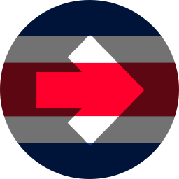
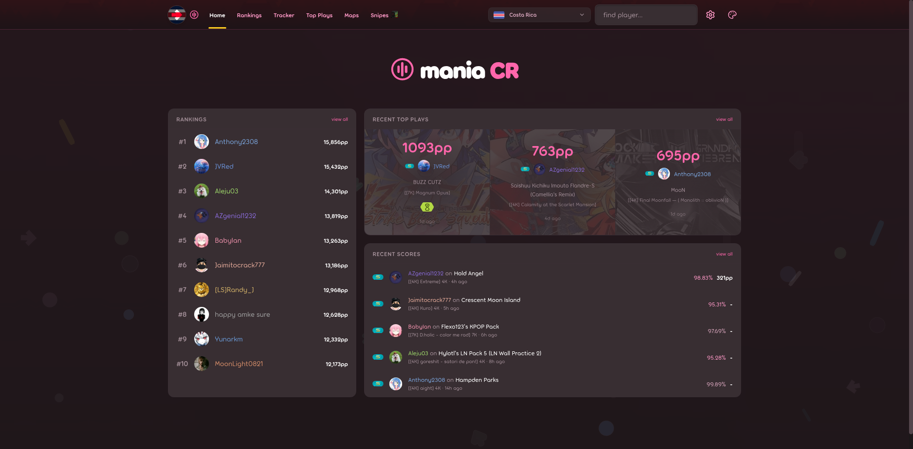
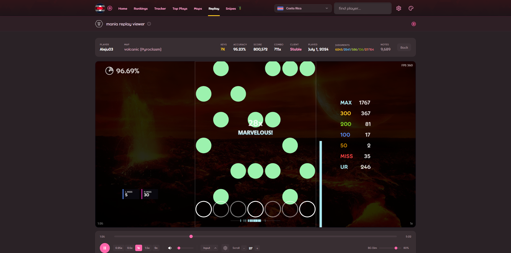

  

  <h1>Mania Tracker</h1>

  

    osu!mania rankings, live score tracking, top plays, maps, snipes, farm picks, player profiles, goals, card packs, and a replay viewer.
  

  

    <a href="https://mania-tracker.com"><strong>mania-tracker.com</strong></a>
  

  

    
    
    
    
  

Pick a country (or the global scope) and see what's going on in its osu!mania scene: who's climbing the rankings, who just popped off, what maps everyone's farming, who got sniped. Countries aren't hardcoded; visiting one starts tracking it, and a synthetic global scope aggregates everything.

## Features

| Feature | What it does |
| --- | --- |
| Rankings | Country and global osu!mania rankings with 7-day rank movement. |
| Live tracker | Real-time score feed across tracked players, streamed to the browser over SSE. |
| Top plays | Scores confirmed to have entered a player's top plays, with the PP they gained. |
| Maps | A searchable mania map browser with pattern/skill filters, farm stats per country and globally, and an hourly qualified-maps watch. |
| Snipes | First-place takeovers on per-map country leaderboards. |
| Farm helper | PP-gain recommendations built by comparing a player's top 200 against peers at similar PP. |
| Player profiles | Stats, recent plays, per-skill activity history, dan estimate, BBCode "me!" pages, and a 3D mania card. |
| Goals | Personal targets (PP, accuracy, grades, FCs, rank) that auto-complete the moment a qualifying play is ingested. |
| My Stats | A signed-in dashboard: personal records, play-rhythm clock, mods fingerprint, tracked feed, and Etterna-style skill ratings per keymode. |
| Card packs | A collectible maniacard economy: open packs, collect player cards, recycle duplicates for shards. |
| Replay viewer | Parse and render `.osr` replays with custom skins and overlays. |
| Skins | Upload and share replay-viewer skins in a community gallery. |
| Dan estimates | Algorithmic dan and LN dan classification for 4K/6K/7K charts, no curated lists. |
| Discord bot | maniabot: slash commands, score cards, and per-channel feeds for top plays, snipes, and new farm maps. |

## How it works

Two cooperating parts:

- **Frontend** (`src/`): TanStack Start + React 19, SSR via Nitro (node-server), self-hosted on the VPS behind Cloudflare. File-based routes, one Zustand store persisted to localStorage, Tailwind CSS v4.
- **Live backend** (`live-backend/`): always-on Node service that ingests osu! scores from [Kayla's oSC feed](https://osc.kaysting.dev) (with JSON backfill and an osu! API fallback poller), keeps durable SQLite projections, runs a DB-backed job queue (enrichment, rosters, snipe boards, chart analysis, dan estimates, skill ratings, activity analysis), and pushes deltas to browsers over SSE.

Browsers fetch a snapshot on page entry and subscribe to `/api/live` for updates; reconnects replay missed events via `Last-Event-ID`. All authenticated osu! API calls stay server-side behind a token-bucket rate limiter, and heavy computed artifacts are cached in R2.

`AGENTS.md` is the condensed guide for coding agents; the fuller reference (endpoints, job types, per-feature models) lives in `docs/`.
